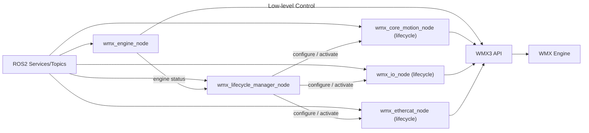
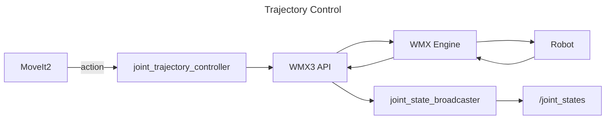

# WMX R2: ROS2 robotics on industrial-grade motion

[](https://github.com/movensys/wmx-r2/actions/workflows/ci.yml)
[](https://docs.ros.org)
[](LICENSE.txt)
[](https://movensys.github.io/wmx-r2-doc/)

WMX R2 is a ROS2 interface to [WMX3](https://www.movensys.com/en/products/software_motion_control/wmx_en),
Movensys' software real-time EtherCAT motion engine. Perception, planning and
deterministic motion all run on **one IPC**, with no external motion controller
and no TCP/IP hop between the planner and the drives. In the See–Think–Act loop of
Physical AI, this is the Act layer.

**WMX R2 runs on any EtherCAT machine, on ordinary Linux PC hardware.** It
commands servo drives directly over EtherCAT, so it does not depend on the
brand of the robot or of the drives. It controls **axes**, not a specific robot model, so a six-axis arm, a differential-drive base and a custom multi-axis machine are all driven the same way; moving between them changes three files, the axis parameter XML, the URDF and the planning config. The host is a normal PC.
**x86-64 or arm64**, from an industrial PC to an NVIDIA Jetson Orin or Thor,
running a **PREEMPT_RT** Linux kernel. Motion is software: no motion-control
card, no vendor external controller.

Check this link for more detailed explanation: https://movensys.github.io/wmx-r2-doc/

## WMX R2 brings advanced robotics capabilities into industrial-grade motion systems

Industrial motion is **mature on its own terms**. EtherCAT, servo control,
deterministic communication, safety and production reliability are well
understood and already deployed. **Capability is the part that isn't settled.**
As processes grow more complex, classical motion programming runs out of
expression.

ROS2 ecosystem provides perception, obstacle avoidance, autonomous navigation, motion
planning and AI manipulation, in Isaac ROS, Nav2, MoveIt2 and a steady stream of
other frameworks. They also move far faster than any vendor's controller
firmware. 

WMX R2 connects these two. The ROS2 stack decides, the WMX engine
executes on a deterministic cycle, and both run on the same machine. So new
capability can be adopted as it appears without giving up the cycle timing,
reliability and IO that industrial production equipment depends on.

## WMX R2 moves robotics technology from the laboratory into real industrial applications

Research hardware is chosen to make a result provable, not to make a product. A
new perception, planning or control method is validated by beating an existing
one under identical conditions.

Industrial communication, servo drives, deterministic control,
industrial IO, integration and safety are a discipline separate from the
algorithm work, and crossing that distance normally means rewriting the motion
layer for the target machine behind a vendor's closed toolchain. 

**WMX R2 removes the rewrite.** The same interface that drives a bench setup drives the
production machine.

## Why WMX R2

| | |
|---|---|
| **ROS2 and AI on the Industrial** | MoveIt2, MoveIt Servo, Nav2 and Isaac ROS command EtherCAT servos through standard ROS2 actions, topics and services, with no vendor motion code |
| **One IPC, no external controller** | Removing the external controller's TCP/IP hop and its redundant control stage cut mean absolute tracking error by 85% versus a conventional setup ([benchmark](https://movensys.github.io/wmx-r2-doc/)) |
| **Any EtherCAT machine** | Nothing is baked into the launch files. A manipulator, a mobile base or a 50-axis machine differ only by the config, URDF and WMX parameter XML you pass in |
| **Down to the register** | Axis, IO, EtherCAT master and engine control are all exposed as services, so commissioning and diagnostics need no extra tooling |
| **Proven engine** | WMX3: 25+ years of development, 40+ patents, 40,000+ licences, 500+ customers in semiconductor and industrial automation |
| **Two distros, CI-tested** | ROS2 Humble and Jazzy, amd64 and arm64 |
| **Free to develop with** | Nothing to buy to start. The motion engine runs free in **6-hour sessions**, renewed by restarting it; a commercial licence lifts the session limit for production |

## Requirements

> This package drives real motion hardware in real time. It is beyond a simulator.

- **WMX Linux** (real-time patched) with the WMX3 SDK installed. See [WMX installation](https://movensys.github.io/wmx-r2-doc/getting_started/install_wmx3.html).
- EtherCAT servo drives / IO reachable from the WMX3 master.
- ROS2 **Humble** or **Jazzy**, with `rmw_cyclonedds` as the RMW.
- Root for real-time scheduling: `sudo --preserve-env` on the host, or `wros` in the container.

## Quickstart

Set up `~/.bashrc`, clone and start the container first: see
[doc/first_setup.md](doc/first_setup.md). `wros` runs a command inside the
container as root with ROS and the workspace sourced.

```bash
# 1. Build (messages first, then the rest)
wros colcon build --packages-select wmx_r2_message
wros colcon build

# 2. Launch the low-level nodes (engine, core motion, IO, EtherCAT)
wros ros2 launch wmx_r2_package wmx_r2_general_nodes.launch.py \
    use_sim_time:=false \
    'config_file:=$(ros2 pkg prefix --share wmx_r2_package)/config/wmx_r2_general_nodes_config.yaml' \
    'wmx_param_file:=$(ros2 pkg prefix --share wmx_r2_package)/config/wmx_parameters.xml'

# 3. Bring axes online and command a move
wros ros2 service call /wmx/axes/set_servo_on wmx_r2_message/srv/SetAxes "{axis: [0,1], data: [1,1]}"
wros ros2 service call /wmx/axes/start_pos wmx_r2_message/srv/StartAxesPose \
    "{axis: [0,1], target: [8388608, 10000], velocity: [1000000, 5000], acc: [100000, 1000], dec: [100000, 1000]}"
```

Full startup sequence and the complete service/topic catalog:
[doc/reference_general_nodes.md](doc/reference_general_nodes.md).

## Architecture

### Low-level control ([wmx_r2_general_nodes.launch.py](wmx_r2_package/launch/wmx_r2_general_nodes.launch.py))



`wmx_engine_node` owns the WMX3 engine and nothing else.
`wmx_lifecycle_manager_node` watches it and drives every other WMX node, each a
[managed (lifecycle) node](https://design.ros2.org/articles/node_lifecycle.html)
that starts `unconfigured` and only attaches to the device at `configure`.

**The managed nodes follow the engine.** While the engine is communicating, every
node found on the graph is brought up to `active`; a node that joins late or
respawns is picked up on a later sweep. When the engine stops or its device is
closed, they are all deactivated and cleaned back to `unconfigured` (their device
handles are dead), and brought up again when the engine returns. This is not
limited to WMX nodes: any managed node in the same namespace (a lifecycle
`joint_state_publisher`, a nav2 node, your own) is driven the same way. Order it
with the manager's `managed_nodes` parameter, or drive nodes by hand:

```bash
# Lifecycle nodes the manager can see, and their states
ros2 service call /wmx/lifecycle/get_node_states wmx_r2_message/srv/GetNodeStates "{}"

# Drive one node by name
ros2 service call /wmx/lifecycle/set_node_state wmx_r2_message/srv/SetNodeState \
  "{node_name: 'wmx_io_node', transition: 'deactivate'}"

# Drive every node at once: leave node_name empty
ros2 service call /wmx/lifecycle/set_node_state wmx_r2_message/srv/SetNodeState \
  "{node_name: '', transition: 'bringdown'}"
```

`transition` is one of `configure`, `activate`, `deactivate`, `cleanup`,
`shutdown`, `bringup` (configure + activate) or `bringdown` (deactivate).
Transitions that take nodes down are applied in reverse bring-up order. The
standard `ros2 lifecycle` CLI works on the nodes directly as well.

### Trajectory control ([wmx_r2_manipulator.launch.py](wmx_r2_package/launch/wmx_r2_manipulator.launch.py))



- `MoveIt2` -> `joint_trajectory_controller` -> WMX3 API -> WMX Engine -> Robot
- Robot -> WMX Engine -> WMX3 API -> `joint_state_broadcaster` -> `/joint_states`

## Packages

| Package | Description |
|---------|-------------|
| [wmx_r2_message](wmx_r2_message/) | Custom messages and services for axis, IO, EtherCAT, and engine control |
| [wmx_r2_package](wmx_r2_package/) | Main nodes, launch files, and robot configurations |
| [wmx_r2_control](wmx_r2_control/) | `ros2_control` hardware interface, URDF xacros, and controller configs |

## Nodes

| Node | Role |
|------|------|
| `wmx_engine_node` | Owns the WMX3 engine: device creation, EtherCAT communication, parameter import, engine status |
| `wmx_lifecycle_manager_node` | Drives every lifecycle node below, following the engine's status |
| `wmx_core_motion_node` | Per-axis servo, alarm, gear-ratio, homing, point-to-point, velocity and jog services plus `wmx/axes/status` (lifecycle) |
| `wmx_io_node` | IO control for input/output bits and bytes (lifecycle) |
| `wmx_ethercat_node` | EtherCAT master operations, network scan and slave management (lifecycle) |
| `joint_trajectory_controller` | Receives `FollowJointTrajectory` goals and executes them via WMX3 C-spline (lifecycle) |
| `joint_position_controller` | Follows MoveIt Servo's streamed `JointTrajectory` via WMX3 linear interpolation, so every axis arrives at the same instant (lifecycle) |
| `differential_drive_controller` | Differential-drive command and dead-reckoned odometry loop (lifecycle) |
| `joint_state_broadcaster` | Publishes encoder feedback to `/joint_states`; clears alarms and switches the servos on when activated (lifecycle) |
| `gripper_controller` | Gripper open/close over a WMX IO output bit (lifecycle) |

## Launch files

| Launch file | Purpose | Nodes started |
|-------------|---------|---------------|
| [wmx_r2_general_nodes.launch.py](wmx_r2_package/launch/wmx_r2_general_nodes.launch.py) | Low-level axis / IO / EtherCAT control | `wmx_engine_node`, `wmx_lifecycle_manager_node`, `wmx_core_motion_node`, `wmx_io_node`, `wmx_ethercat_node` |
| [wmx_r2_manipulator.launch.py](wmx_r2_package/launch/wmx_r2_manipulator.launch.py) | Manipulator trajectory control | general nodes + `joint_state_broadcaster`, `joint_trajectory_controller`, `joint_position_controller`, and `gripper_controller` when `use_gripper:=true` |
| [wmx_r2_differential.launch.py](wmx_r2_package/launch/wmx_r2_differential.launch.py) | Differential-drive base control | general nodes + `joint_state_broadcaster`, `differential_drive_controller` |
| [wmx_r2_control_manipulator.launch.py](wmx_r2_control/launch/wmx_r2_control_manipulator.launch.py) | Manipulator through `ros2_control` | general nodes + `joint_trajectory_controller`, `joint_position_controller`, `robot_state_publisher`, `ros2_control_node` (`WmxSystemHardware`), a `joint_state_broadcaster` spawner and an Isaac Sim relay |
| [wmx_r2_control_differential.launch.py](wmx_r2_control/launch/wmx_r2_control_differential.launch.py) | Differential base through `ros2_control` | general nodes + `robot_state_publisher`, `ros2_control_node` (`WmxSystemHardware`), `joint_state_broadcaster` and `diff_drive_controller` spawners, and an Isaac Sim relay |

No robot is baked into any launch file. Each takes its paths as launch
arguments (`config_file` and `wmx_param_file`, plus `urdf_file` and
`controllers_file` on the `ros2_control` ones), so one launch file serves every
robot of that kind. The per-robot examples live in
[wmx_r2_package/example/](wmx_r2_package/example/).

## MoveIt2 integration

To connect with `movensys-manipulator`, set the action name in the manipulator
config (example: `example/cr3a_manipulator_config.yaml`) to the controller name
MoveIt2 is configured to call:

```yaml
joint_trajectory_action: /movensys_manipulator_arm_controller/follow_joint_trajectory
```

## Documentation

| Doc | Description |
|-----|-------------|
| [doc/first_setup.md](doc/first_setup.md) | Environment setup, Docker setup, dependencies, build |
| [doc/launch_general_nodes.md](doc/launch_general_nodes.md) | Launch the WMX general nodes |
| [doc/launch_manipulator.md](doc/launch_manipulator.md) | Launch a manipulator |
| [doc/launch_differential.md](doc/launch_differential.md) | Launch the differential-drive base |
| [doc/reference_general_nodes.md](doc/reference_general_nodes.md) | Every service and topic of the general nodes, with the startup sequence |
| [doc/reference_manipulator.md](doc/reference_manipulator.md) | Manipulator node reference: parameters, arbitration, lifecycle |
| [doc/reference_differential.md](doc/reference_differential.md) | Differential node reference: parameters, kinematics, odometry |

Full documentation, application examples and integration scenarios:
**[movensys.github.io/wmx-r2-doc](https://movensys.github.io/wmx-r2-doc/)**

## What's included

- [x] Engine, lifecycle, axis, IO, and EtherCAT master control nodes
- [x] Lifecycle manager that follows the engine state and drives every controller
- [x] Manipulator stack: joint state feedback, trajectory action, streamed position, gripper
- [x] Differential-drive stack: velocity command, wheel feedback, dead-reckoned odometry
- [x] MoveIt2 integration: `FollowJointTrajectory` action plus a MoveIt Servo streaming path
- [x] `ros2_control` hardware interface (`wmx_system_hardware`) for both stacks
- [x] Hardware-agnostic launch files: config, WMX parameters, URDF and controllers are all arguments
- [x] Digital-twin mirror topics for Isaac Sim and Gazebo
- [x] Containerised setup for amd64 and arm64
- [x] CI on ROS2 Humble and Jazzy: lint, message build/test, launch-description checks

## Demo

### Physical AI powered by WMX ROS2 on NVIDIA Jetson Thor

[](https://www.youtube.com/watch?v=h-G9vtAGAIU)

## License

The ROS2 interface in this repository is [MIT](LICENSE.txt). It builds against
and runs on the proprietary WMX3 motion engine, which is free to develop with in
6-hour sessions renewed by restarting the engine; production use needs a
commercial licence. **"WMX R2" as a whole is therefore not MIT.** See the
[licensing boundary](https://movensys.github.io/wmx-r2-doc/licensing.html).
