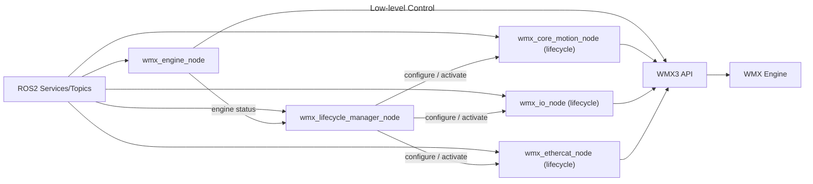
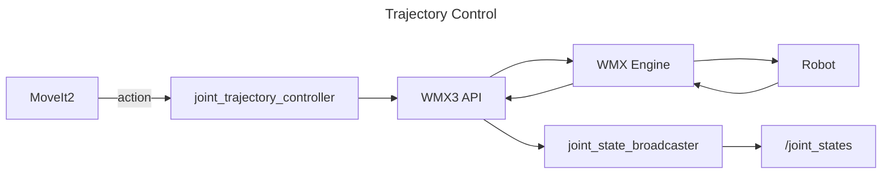

# WMX R2 Application

[](https://github.com/movensys/wmx-r2/actions/workflows/ci.yml)
[](https://docs.ros.org)
[](LICENSE.txt)
[](https://movensys.github.io/wmx-r2-doc/)

ROS2 interface for [WMX3](https://www.movensys.com/en/products/software_motion_control/wmx_en), a real-time EtherCAT motion control SDK by Movensys, enabling control of industrial robots and multi-axis systems from the ROS2 ecosystem.

This package wraps the WMX3 C++ API into standard ROS2 nodes, topics, services, and actions, so you can drive any Ethercat hardware using MoveIt2, Nav2, or any ROS2-compatible planner without writing vendor-specific motion code.

## Features

- **Real-time motion:** deterministic multi-axis control over EtherCAT through the WMX3 engine.
- **ROS2 native:** exposes WMX3 as standard nodes, topics, services, and actions.
- **MoveIt2 / Nav2 ready:** trajectory execution and joint-state feedback with no vendor-specific motion code.
- **Full low-level access:** axis, IO, EtherCAT master, and engine control from the command line or your own nodes.
- **Dual distro:** supported and CI-tested on ROS2 **Humble** and **Jazzy**.
- **Hardware-proven:** ships configurations for the manipulators and a differential-drive base.

## Requirements

> **Note:** This package controls real motion hardware and requires a real-time environment. It is not a simulator.

- **WMX Linux** (real-time patched) with the WMX3 SDK pre-installed (see [WMX installation](https://movensys.github.io/wmx-r2-doc/getting_started/install_wmx3.html)).
- EtherCAT-capable hardware (servo drives / IO reachable from the WMX3 master).
- ROS2 **Humble** or **Jazzy**.
- `rmw_cyclonedds` as the RMW implementation.
- Manipulator launches require **root** (real-time scheduling), started via `sudo --preserve-env` on the host or `wros` in the container.

## Quickstart

Set up `~/.bashrc`, clone, and bring the container up first — see [doc/first_setup.md](doc/first_setup.md).
`wros` runs a command inside the container as root with ROS and the workspace already sourced.

```bash
# 1. Build (messages first, then the rest)
wros colcon build --packages-select wmx_r2_message
wros colcon build

# 2. Launch the low-level nodes (engine, core motion, IO, EtherCAT)
wros ros2 launch wmx_r2_package wmx_r2_general_nodes.launch.py \
    use_sim_time:=false \
    'config_file:=$(ros2 pkg prefix --share wmx_r2_package)/config/wmx_r2_general_nodes_config.yaml' \
    'wmx_param_file:=$(ros2 pkg prefix --share wmx_r2_package)/config/wmx_parameters.xml'

# 3. Bring axes online and command a move
wros ros2 service call /wmx/axes/set_servo_on wmx_r2_message/srv/SetAxes "{axis: [0,1], data: [1,1]}"
wros ros2 service call /wmx/axes/start_pos wmx_r2_message/srv/StartAxesPose \
    "{axis: [0,1], target: [8388608, 10000], velocity: [1000000, 5000], acc: [100000, 1000], dec: [100000, 1000]}"
```

The full startup sequence and the complete service/topic catalog are documented in
[doc/reference_general_nodes.md](doc/reference_general_nodes.md).

## Architecture

### Low-level Control ([wmx_r2_general_nodes.launch.py](wmx_r2_package/launch/wmx_r2_general_nodes.launch.py))



`wmx_engine_node` owns the WMX3 engine and nothing else.
`wmx_lifecycle_manager_node` watches it and drives every other WMX node, each a
[managed (lifecycle) node](https://design.ros2.org/articles/node_lifecycle.html)
that starts `unconfigured` and only attaches to the device at `configure`.

**The managed nodes follow the engine.** While the engine is communicating, every
node found on the graph is brought up to `active` — a node that joins late or
respawns is picked up on a later sweep. When the engine stops or its device is
closed, they are all deactivated and cleaned back to `unconfigured` (their device
handles are dead), and brought up again when the engine returns. This is not
limited to WMX nodes: any managed node in the same namespace (a lifecycle
`joint_state_publisher`, a nav2 node, your own) is driven the same way. Order it
with the manager's `managed_nodes` parameter, or drive nodes by hand:

```bash
# Lifecycle nodes the manager can see, and their states
ros2 service call /wmx/lifecycle/get_node_states wmx_r2_message/srv/GetNodeStates "{}"

# Drive one node by name
ros2 service call /wmx/lifecycle/set_node_state wmx_r2_message/srv/SetNodeState \
  "{node_name: 'wmx_io_node', transition: 'deactivate'}"

# Drive every node at once: leave node_name empty
ros2 service call /wmx/lifecycle/set_node_state wmx_r2_message/srv/SetNodeState \
  "{node_name: '', transition: 'bringdown'}"
```

`transition` is one of `configure`, `activate`, `deactivate`, `cleanup`,
`shutdown`, `bringup` (configure + activate) or `bringdown` (deactivate).
Transitions that take nodes down are applied in reverse bring-up order. The
standard `ros2 lifecycle` CLI works on the nodes directly as well.

### Trajectory Control ([wmx_r2_manipulator.launch.py](wmx_r2_package/launch/wmx_r2_manipulator.launch.py))



- `MoveIt2` -> `joint_trajectory_controller` -> WMX3 API -> WMX Engine -> Robot
- Robot -> WMX Engine -> WMX3 API -> `joint_state_broadcaster` -> `/joint_states`

## Packages

| Package | Description |
|---------|-------------|
| [wmx_r2_message](wmx_r2_message/) | Custom messages and services for axis, IO, EtherCAT, and engine control |
| [wmx_r2_package](wmx_r2_package/) | Main nodes, launch files, and robot configurations |
| [wmx_r2_control](wmx_r2_control/) | `ros2_control` hardware interface, URDF xacros, and controller configs |

## Nodes

| Node | Role |
|------|------|
| `wmx_engine_node` | Engine and device initialization; owns the WMX3 engine and reports its status |
| `wmx_lifecycle_manager_node` | Drives every lifecycle node below, following the engine's status |
| `wmx_core_motion_node` | Core motion control and trajectory execution (lifecycle) |
| `wmx_io_node` | IO control for input/output bits and bytes (lifecycle) |
| `wmx_ethercat_node` | EtherCAT master operations, network scan and slave management (lifecycle) |
| `joint_trajectory_controller` | Receives trajectory actions and executes via WMX3 C-Spline (lifecycle) |
| `joint_position_controller` | Follows MoveIt Servo's streamed `JointTrajectory` via WMX3 linear interpolation, so every axis arrives at the same instant (lifecycle) |
| `differential_drive_controller` | Differential-drive command and odometry loop (lifecycle) |
| `joint_state_broadcaster` | Publishes joint feedback from the WMX3 encoder to `/joint_states`; clears alarms and switches the servos on when activated (lifecycle) |
| `gripper_controller` | Gripper command handling for manipulators (lifecycle) |

## Launch Files

| Launch file | Purpose | Nodes started |
|-------------|---------|---------------|
| [wmx_r2_general_nodes.launch.py](wmx_r2_package/launch/wmx_r2_general_nodes.launch.py) | Low-level axis / IO / EtherCAT control | `wmx_engine_node`, `wmx_lifecycle_manager_node`, `wmx_core_motion_node`, `wmx_io_node`, `wmx_ethercat_node` |
| [wmx_r2_manipulator.launch.py](wmx_r2_package/launch/wmx_r2_manipulator.launch.py) | Manipulator trajectory control | general nodes + `joint_state_broadcaster`, `joint_trajectory_controller`, `joint_position_controller`, and `gripper_controller` when `use_gripper:=true` |
| [wmx_r2_differential.launch.py](wmx_r2_package/launch/wmx_r2_differential.launch.py) | Differential-drive base control | general nodes + `joint_state_broadcaster`, `differential_drive_controller` |
| [wmx_r2_control_manipulator.launch.py](wmx_r2_control/launch/wmx_r2_control_manipulator.launch.py) | Manipulator through `ros2_control` | manipulator nodes + `robot_state_publisher`, `ros2_control_node`, controller spawners |
| [wmx_r2_control_differential.launch.py](wmx_r2_control/launch/wmx_r2_control_differential.launch.py) | Differential base through `ros2_control` | general nodes + `robot_state_publisher`, `ros2_control_node`, controller spawners |

No robot is baked into any launch file. Each takes its paths as launch
arguments — `config_file` and `wmx_param_file`, plus `urdf_file` and
`controllers_file` on the `ros2_control` ones — so one launch file serves every
robot of that kind. The per-robot examples live in
[wmx_r2_package/example/](wmx_r2_package/example/).

## MoveIt2 Integration

To connect with `movensys-manipulator`, change the action name in the manipulator config (example: `example/cr3a_manipulator_config.yaml`):

```yaml
joint_trajectory_action: /movensys_manipulator_arm_controller/follow_joint_trajectory
```

## Documentation

To quickly set up the WMX ROS2 package and explore its key features, follow these steps:

| Doc | Description |
|-----|-------------|
| [doc/first_setup.md](doc/first_setup.md) | Environment setup, Docker setup, dependencies, build |
| [doc/launch_general_nodes.md](doc/launch_general_nodes.md) | Launch the WMX general nodes |
| [doc/launch_manipulator.md](doc/launch_manipulator.md) | Launch a manipulator  |
| [doc/launch_differential.md](doc/launch_differential.md) | Launch the differential-drive base |
| [doc/reference_general_nodes.md](doc/reference_general_nodes.md) | ROS2 service/topic reference with startup sequence |
| [doc/reference_manipulator.md](doc/reference_manipulator.md) | Manipulator node reference |
| [doc/reference_differential.md](doc/reference_differential.md) | Differential node reference |

For the complete and up-to-date documentation, please visit the official site:
**[WMX R2 Documentation](https://movensys.github.io/wmx-r2-doc/)**

## Roadmap

Done

- [x] Engine, lifecycle, axis, IO, and EtherCAT master control nodes
- [x] Lifecycle manager that follows the engine state and drives every controller
- [x] Manipulator stack: joint state feedback, trajectory action, streamed position, gripper
- [x] Differential-drive stack: velocity command, wheel feedback, dead-reckoned odometry
- [x] MoveIt2 integration: `FollowJointTrajectory` action plus a MoveIt Servo streaming path
- [x] `ros2_control` hardware interface (`wmx_system_hardware`) for both stacks
- [x] Hardware-agnostic launch files — config, WMX parameters, URDF and controllers are all arguments
- [x] Digital-twin mirror topics for Isaac Sim and Gazebo
- [x] Containerised setup for amd64 and arm64
- [x] CI on ROS2 Humble and Jazzy: lint, message build/test, launch-description checks


## Demo Videos

### Physical AI powered by WMX ROS2 on NVIDIA Jetson Thor
[](https://www.youtube.com/watch?v=h-G9vtAGAIU)

## License

This project is released under the [MIT License](LICENSE.txt).
